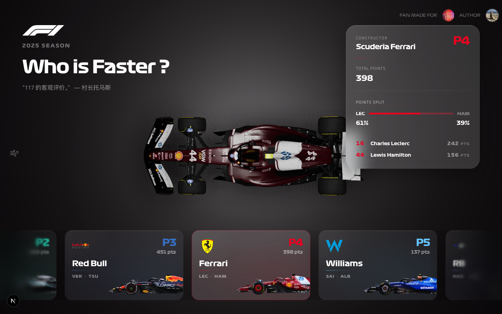
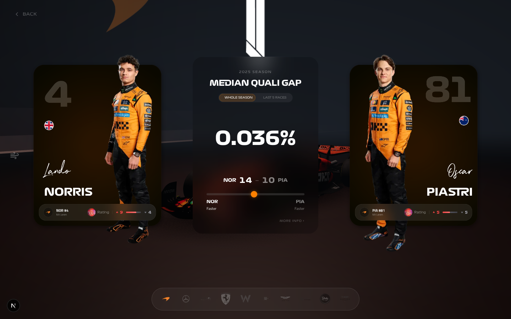
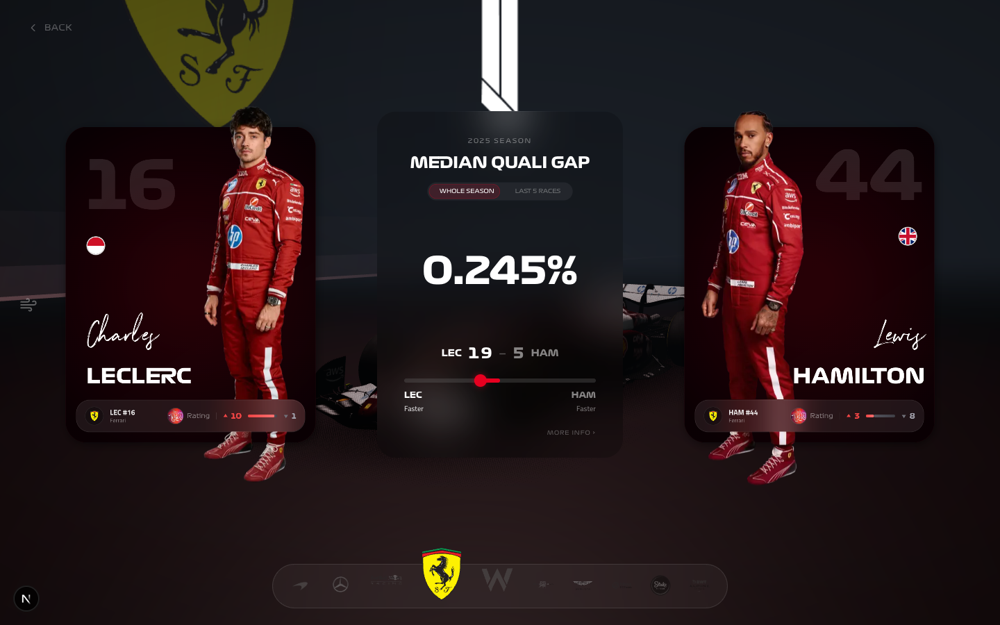
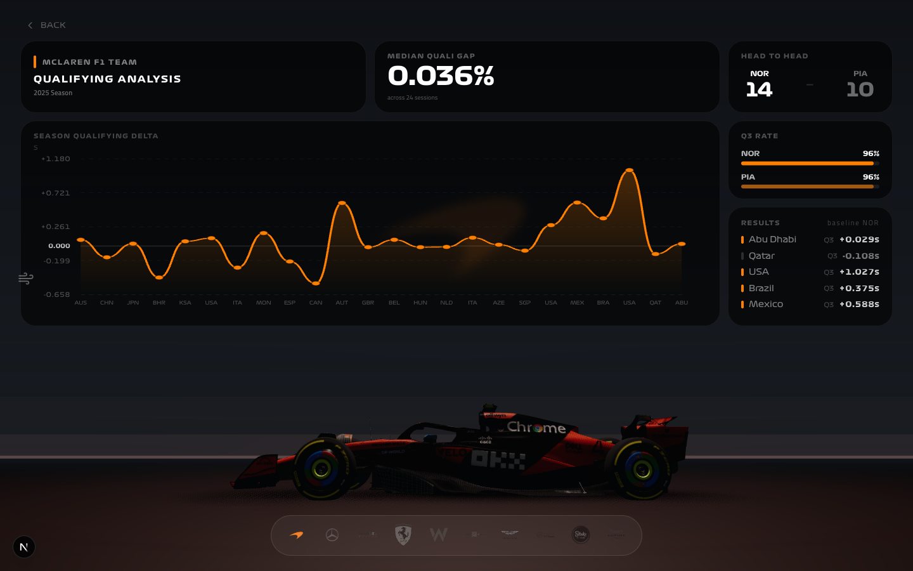

<div align="center">


# F1 Flying Lap

### Teammate Qualifying Gap Visualizer — 2025 Season

An immersive, data-driven web experience that compares **Formula 1 teammate qualifying performance** with cinematic 3D visuals, real-time statistics, and interactive analytics.

**[Live Demo](https://f1-flyinglap.vercel.app)** · **[中文文档](README.zh-CN.md)**


</div>

---

## Screenshots

### Grid Stage — Team Carousel

Browse all 10 Formula 1 constructor teams ranked by championship standings. Hover to preview team details, click to dive into teammate analysis.



### Versus Stage — Teammate Comparison

Head-to-head qualifying matchup with driver portraits, median qualifying gap, head-to-head record, and podcast ratings from 飞驰圈 (Flying Lap Podcast).





### Graph Stage — Deep Analytics Dashboard

Full qualifying analysis with season delta chart, Q3 appearance rates, race-by-race results table, and an interactive 3D car model.



---

## What is F1 Flying Lap?

**F1 Flying Lap** is a fan-made interactive web application that visualizes teammate qualifying performance across the 2025 Formula 1 season. It answers the fundamental question every F1 fan asks: **"Who is faster — the driver or his teammate?"**

The app computes **median qualifying gaps** (percentage-based) to eliminate outliers and provide a fair, objective metric for comparing drivers within the same machinery. Data is sourced from the official F1 timing system via [FastF1](https://github.com/theOehrly/Fast-F1) and updated automatically after every race weekend.

### Key Features

- **3D Car Models** — Interactive Three.js renders of all 10 constructor cars with top-down, cinematic, and side-profile camera modes
- **F1 Starting Lights** — Authentic five-light sequence animation as the app loader
- **Team Carousel** — Horizontally scrollable grid of all teams with live championship standings
- **Versus Mode** — Side-by-side driver comparison with portraits, nationality flags, and median gap
- **Analytics Dashboard** — Season qualifying delta line chart, head-to-head record, Q3 rates, and per-race results
- **Time Scope Toggle** — Switch between "Whole Season" and "Last 5 Races" to track recent form
- **飞驰圈 Podcast Integration** — 红黑榜 (Red/Black Rating) badges showing podcast mentions per driver
- **Automated Data Pipeline** — GitHub Actions cron job updates data every Monday via FastF1
- **Official F1 Typography** — Formula 1 Bold, Regular, and Wide typefaces throughout the interface
- **Team Color Theming** — Dynamic accent colors matching each constructor's brand identity
- **Easter Egg Audio** — Driver-specific radio clips for select drivers

---

## Tech Stack

| Layer | Technology |
|-------|-----------|
| **Framework** | [Next.js 16](https://nextjs.org) (App Router, React Server Components) |
| **UI** | [React 19](https://react.dev), [TypeScript 5.9](https://typescriptlang.org) |
| **3D Graphics** | [Three.js](https://threejs.org) with Draco compression, postprocessing effects |
| **Animation** | [GSAP](https://gsap.com) timelines, [Framer Motion](https://motion.dev) spring physics |
| **Styling** | [Tailwind CSS 4](https://tailwindcss.com), [shadcn/ui](https://ui.shadcn.com), [Radix UI](https://radix-ui.com) |
| **State** | [Zustand](https://zustand.docs.pmnd.rs) (stage, team, driver, camera state) |
| **Charts** | [Recharts](https://recharts.org) + custom SVG qualifying delta chart |
| **Data Pipeline** | Python + [FastF1](https://github.com/theOehrly/Fast-F1) + GitHub Actions |
| **Fonts** | Formula 1 Official (Bold/Regular/Wide), Titillium Web, Northwell |
| **Linting** | [Biome](https://biomejs.dev), [Prettier](https://prettier.io) |
| **Testing** | [Playwright](https://playwright.dev) E2E |

---

## Project Structure

```
f1-flyinglap/
├── app/                        # Next.js App Router
│   ├── layout.tsx              # Root layout with F1 font configuration
│   ├── page.tsx                # Main page (single-page app)
│   ├── globals.css             # Global styles & Tailwind directives
│   └── assets/                 # Fonts, music, patterns, backgrounds
│
├── components/
│   ├── stages/                 # Stage-based navigation views
│   │   ├── TeamCarousel.tsx    # GRID — team selection carousel
│   │   ├── VersusMode.tsx      # VERSUS — teammate head-to-head
│   │   └── GraphMode.tsx       # GRAPH — analytics dashboard
│   └── ui/                     # 30+ reusable UI components
│       ├── TopDownCarShowcase   # Three.js 3D car renderer
│       ├── FiveLightsOut        # F1 starting lights loader
│       ├── DriverProfileCard    # Driver info with podcast badges
│       ├── QualifyingGapChart   # Qualifying gap visualization
│       ├── SimpleGraph          # Season delta line chart
│       └── ...                  # HUD, custom cursor, backgrounds
│
├── data/
│   └── generated/2025/         # Pre-computed JSON datasets
│       ├── teams.json          # 10 constructors with colors/logos
│       ├── drivers.json        # 20 drivers with career metadata
│       ├── qualifying-results.json
│       ├── races.json          # 24 race weekends
│       └── computed/           # Derived statistics
│           ├── teammate-gaps.json
│           ├── head-to-head.json
│           ├── q3-rates.json
│           └── driver-standings.json
│
├── pipeline/                   # Python data extraction
│   └── src/f1pipeline/         # FastF1-based scrapers & stat computations
│
├── store/
│   └── useAppStore.ts          # Zustand global state (stage, team, camera)
│
├── lib/                        # Utilities (GSAP, preloaders, wind tunnel)
├── types/                      # TypeScript interfaces
├── public/
│   ├── 3d-model/               # GLB car models (Draco-compressed)
│   ├── f1_2025_driver_portraits/
│   ├── f1-2025-cars/           # Side-view car images
│   ├── team-logos/             # Constructor logos
│   └── sound/                  # Audio clips
│
└── .github/workflows/
    └── update-f1-data.yml      # Scheduled data pipeline (every Monday)
```

---

## Getting Started

### Prerequisites

- **Node.js** 20+ (24 LTS recommended)
- **pnpm**, **npm**, or **yarn**
- **Python 3.11+** and [uv](https://docs.astral.sh/uv/) (only for running the data pipeline)

### Installation

```bash
# Clone the repository
git clone https://github.com/zhongth/f1-flyinglap.git
cd f1-flyinglap

# Install dependencies
npm install

# Start the development server
npm run dev
```

Open [http://localhost:3000](http://localhost:3000) — you'll see the F1 starting lights animation, then the team carousel.

### Available Scripts

| Command | Description |
|---------|-------------|
| `npm run dev` | Start Next.js dev server with Turbopack |
| `npm run build` | Build for production |
| `npm run start` | Start production server |
| `npm run lint` | Run Biome linter |
| `npm run format` | Format with Prettier |

---

## Data Pipeline

The qualifying data is extracted from the official F1 timing system using a Python pipeline built on [FastF1](https://github.com/theOehrly/Fast-F1).

```bash
# Navigate to pipeline directory
cd pipeline

# Install with uv
uv sync

# Run the pipeline
uv run python -m f1pipeline.main
```

### Automated Updates

A GitHub Actions workflow (`update-f1-data.yml`) runs **every Monday at 06:00 UTC** — typically after the race weekend concludes. It:

1. Fetches the latest qualifying session data via FastF1
2. Computes teammate gaps, head-to-head records, and Q3 rates
3. Outputs pre-computed JSON to `data/generated/2025/`
4. Auto-commits changes to the repository

Manual triggers are also available via `workflow_dispatch`.

### Data Schema

| File | Description |
|------|-------------|
| `teams.json` | 10 constructors — name, colors, logo, drivers, standings |
| `drivers.json` | 20 drivers — number, nationality, height, career stats, pedigree |
| `qualifying-results.json` | Q1/Q2/Q3 lap times for every race session |
| `races.json` | 24 race weekends — circuit, date, country |
| `teammate-gaps.json` | Median gaps (season & last 5) per team |
| `head-to-head.json` | Qualifying wins per driver pair |
| `q3-rates.json` | Q3 appearance percentage per driver |
| `podcast-hongheibang.json` | 飞驰圈 podcast 红黑榜 mentions |

---

## Architecture

```
┌─────────────┐     ┌──────────────┐     ┌──────────────┐
│   FastF1    │────▶│   Pipeline   │────▶│  JSON Data   │
│  (F1 API)   │     │  (Python)    │     │  (Static)    │
└─────────────┘     └──────────────┘     └──────┬───────┘
                                                │
                    ┌───────────────────────────┘
                    ▼
┌──────────────────────────────────────────────────────┐
│                   Next.js App                         │
│                                                       │
│  ┌─────────┐   ┌──────────┐   ┌──────────────────┐  │
│  │  GRID   │──▶│  VERSUS  │──▶│      GRAPH       │  │
│  │ Stage   │   │  Stage   │   │      Stage       │  │
│  └─────────┘   └──────────┘   └──────────────────┘  │
│       │              │                │               │
│       ▼              ▼                ▼               │
│  TeamCarousel   VersusMode      GraphMode            │
│  3D Car Model   Driver Cards    Delta Chart          │
│  Team Info      Median Gap      H2H / Q3 Rate       │
│                 H2H Record      Race Results         │
│                                                       │
│  ┌───────────────────────────────────────────────┐   │
│  │            Zustand Store                       │   │
│  │  stage · selectedTeam · camera · timeScope     │   │
│  └───────────────────────────────────────────────┘   │
└──────────────────────────────────────────────────────┘
```

---

## Contributing

Contributions are welcome! Whether it's bug fixes, feature ideas, or design improvements:

1. Fork the repository
2. Create a feature branch (`git checkout -b feature/amazing-feature`)
3. Commit your changes
4. Push to the branch (`git push origin feature/amazing-feature`)
5. Open a Pull Request

---

## Credits

- **Data**: [FastF1](https://github.com/theOehrly/Fast-F1) — Open-source F1 data library
- **Podcast**: [飞驰圈 Flying Lap Podcast](https://www.youtube.com/playlist?list=PL3g6oz4W-l1k0YrzaNaaGoI3MXwx96PoC) — 红黑榜 driver ratings
- **3D Models**: F1 2025 car assets
- **Driver Portraits**: Official F1 media
- **Design Inspiration**: Formula 1 broadcast graphics, F1 TV timing tower

---

## License

This project is open source under the [MIT License](LICENSE).

---

<div align="center">

**Built with passion for Formula 1** by [Edward](https://github.com/zhongth)

Fan-made project for [飞驰圈 Podcast](https://www.youtube.com/playlist?list=PL3g6oz4W-l1k0YrzaNaaGoI3MXwx96PoC)

*F1, Formula 1, and related marks are trademarks of Formula One Licensing BV.*

</div>
